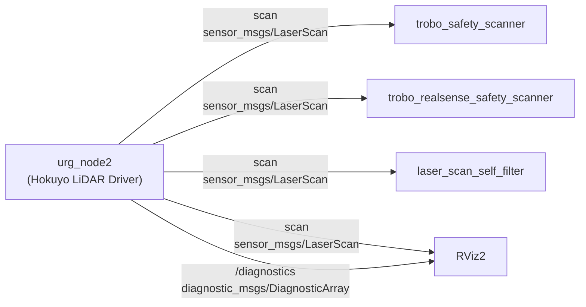

# Interface Definitions

## 1. Overview

The `urg_node2` package does not define any custom interface types (.msg / .srv / .action). It uses standard `sensor_msgs` and `diagnostic_msgs` message types to publish LiDAR scan data and diagnostic information.

As a lifecycle node, standard lifecycle control services (`lifecycle_msgs`) are automatically provided.

## 2. Usage Package Map

## 3. Published Topic Details

### 3.1. scan (Single Echo Mode)

Published when `publish_multiecho` is `false`.

- **Topic Name**: `scan` (remappable via launch arguments)
- **Message Type**: `sensor_msgs/msg/LaserScan`
- **QoS**: depth=20, default settings
- **Publishing Condition**: Active state and successful scan data retrieval

| Field Name | Type | Unit | Description |
| --- | --- | --- | --- |
| `header.stamp` | `builtin_interfaces/Time` | - | Scan acquisition time (corrected) |
| `header.frame_id` | `string` | - | Value of the `frame_id` parameter (leading `/` stripped) |
| `angle_min` | `float32` | rad | Scan start angle (converted from LiDAR steps) |
| `angle_max` | `float32` | rad | Scan end angle (converted from LiDAR steps) |
| `angle_increment` | `float32` | rad | Angle interval between beams = `cluster * urg_step2rad(1)` |
| `time_increment` | `float32` | sec | Time interval between beams |
| `scan_time` | `float32` | sec | Time required for one complete scan |
| `range_min` | `float32` | m | Minimum measurement distance of the LiDAR |
| `range_max` | `float32` | m | Maximum measurement distance of the LiDAR |
| `ranges` | `float32[]` | m | Distance data array. Invalid values are `NaN` |
| `intensities` | `float32[]` | - | Intensity data array (only when `publish_intensity=true` and supported by LiDAR) |

### 3.2. echoes (Multi-Echo Mode)

Published when `publish_multiecho` is `true` and the LiDAR supports multi-echo.

- **Topic Name**: `echoes`
- **Message Type**: `sensor_msgs/msg/MultiEchoLaserScan`
- **QoS**: Set by `laser_proc::LaserPublisher` (depth=20)
- **Publishing Condition**: Active state and successful scan data retrieval

| Field Name | Type | Unit | Description |
| --- | --- | --- | --- |
| `header.stamp` | `builtin_interfaces/Time` | - | Scan acquisition time (corrected) |
| `header.frame_id` | `string` | - | Value of the `frame_id` parameter |
| `angle_min` | `float32` | rad | Scan start angle |
| `angle_max` | `float32` | rad | Scan end angle |
| `angle_increment` | `float32` | rad | Angle interval between beams |
| `time_increment` | `float32` | sec | Time interval between beams |
| `scan_time` | `float32` | sec | Time required for one complete scan |
| `range_min` | `float32` | m | Minimum measurement distance |
| `range_max` | `float32` | m | Maximum measurement distance |
| `ranges` | `LaserEcho[]` | m | Multi-echo distance data (up to 3 echoes per beam) |
| `intensities` | `LaserEcho[]` | - | Multi-echo intensity data (only when `publish_intensity=true`) |

### 3.3. first / last / most_intense (Multi-Echo Decomposition Topics)

`LaserScan` topics automatically generated from multi-echo data by `laser_proc::LaserPublisher`.

| Topic Name | Message Type | Description |
| --- | --- | --- |
| `first` | `sensor_msgs/msg/LaserScan` | Extracts only the first echo from each beam |
| `last` | `sensor_msgs/msg/LaserScan` | Extracts only the last echo from each beam |
| `most_intense` | `sensor_msgs/msg/LaserScan` | Extracts only the most intense echo from each beam |

### 3.4. /diagnostics

Automatically published by `diagnostic_updater`.

- **Topic Name**: `/diagnostics`
- **Message Type**: `diagnostic_msgs/msg/DiagnosticArray`
- **Publishing Condition**: Active state only

See [README.md Section 9: Diagnostic Information](./README.md#9-diagnostic-information) for details.

## 4. Lifecycle Services (Automatically Provided)

The following services are automatically provided by `rclcpp_lifecycle`.

| Service Name | Service Type | Description |
| --- | --- | --- |
| `~/change_state` | `lifecycle_msgs/srv/ChangeState` | Trigger a lifecycle state transition |
| `~/get_state` | `lifecycle_msgs/srv/GetState` | Get the current lifecycle state |
| `~/get_available_states` | `lifecycle_msgs/srv/GetAvailableStates` | Get a list of all possible states |
| `~/get_available_transitions` | `lifecycle_msgs/srv/GetAvailableTransitions` | Get a list of possible transitions from the current state |

## 5. Measurement Mode Reference

The measurement mode is selected based on the combination of LiDAR capabilities and configuration parameters.

| publish_intensity | publish_multiecho | Measurement Mode | Published Topics |
| --- | --- | --- | --- |
| `false` | `false` | `URG_DISTANCE` | `scan` |
| `true` | `false` | `URG_DISTANCE_INTENSITY` | `scan` (with intensities) |
| `false` | `true` | `URG_MULTIECHO` | `echoes`, `first`, `last`, `most_intense` |
| `true` | `true` | `URG_MULTIECHO_INTENSITY` | `echoes`, `first`, `last`, `most_intense` (with intensities) |

If the LiDAR does not support the requested mode, it automatically falls back to a supported mode and a WARN log is output.
