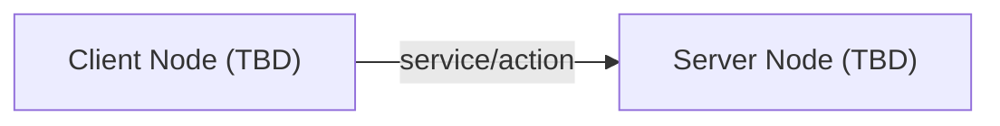

# Interface Definitions

## 1. Overview

<!-- TODO: Describe purpose and usage of this package's interface definitions -->

Hokuyo 2D LiDAR sensor driver. Publishes laser scan data as ROS2 topics

## 2. Usage Package Map

## 3. Message Definitions (.msg)

<!-- TODO: Describe .msg file definitions -->

| Message Name | Field | Type | Unit | Description |
| --- | --- | --- | --- | --- |
| TBD | TBD | TBD | TBD | TBD |

## 4. Service Definitions (.srv)

<!-- TODO: Describe .srv file definitions -->

### TBD.srv

**Purpose**: TBD

**Server Node**: TBD | **Client Node**: TBD

**Request:**

| Field Name | Type | Unit | Description |
| --- | --- | --- | --- |
| TBD | TBD | TBD | TBD |

**Response:**

| Field Name | Type | Description | When success=false |
| --- | --- | --- | --- |
| success | bool | Processing success flag | Error details in message |
| message | string | Result message | Error details |

## 5. Action Definitions (.action)

<!-- TODO: Describe .action file definitions -->

### TBD.action

**Goal:**

| Field Name | Type | Unit | Description |
| --- | --- | --- | --- |
| TBD | TBD | TBD | TBD |

**Result:**

| Field Name | Type | Description |
| --- | --- | --- |
| TBD | TBD | TBD |

**Feedback:**

| Field Name | Type | Description |
| --- | --- | --- |
| TBD | TBD | TBD |
