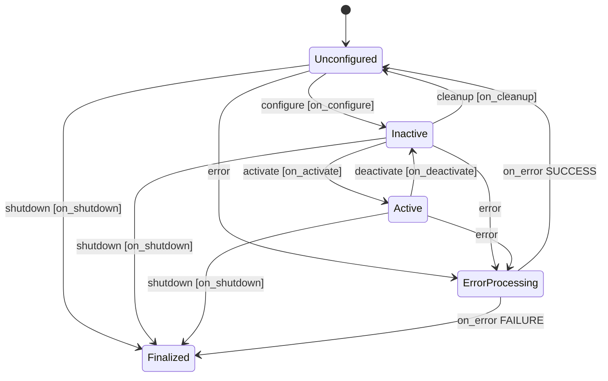
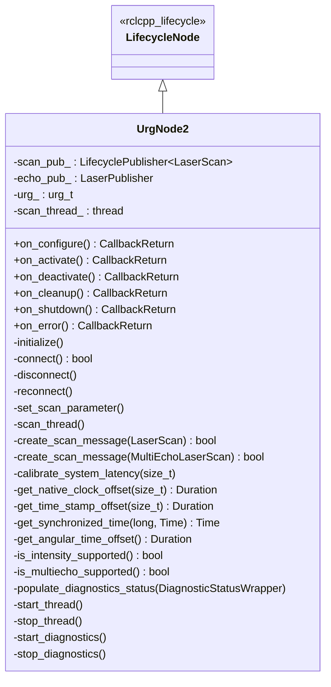
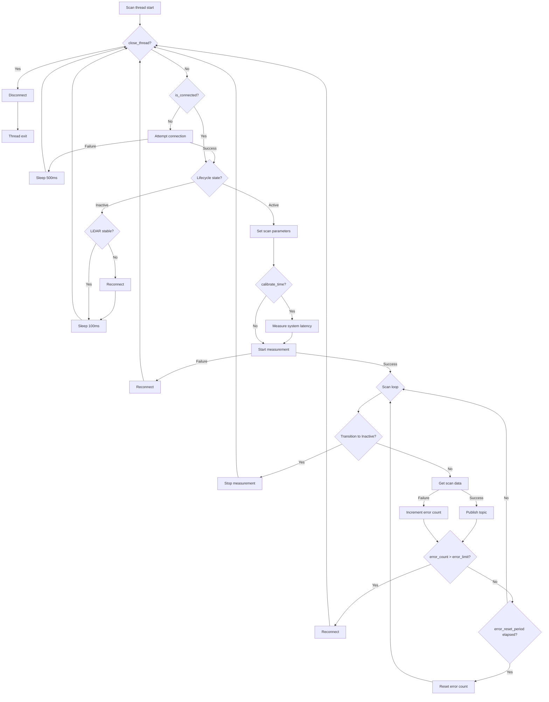

# urg_node2

| Item | Content |
| --- | --- |
| Language | C++ |
| Node Type | Lifecycle Node (`rclcpp_lifecycle::LifecycleNode`) |
| Related PKG Doc | PKG-044 |
| Last Updated | 2026-02-27 |

## 1. Overview

`urg_node2` is a ROS2 driver package for Hokuyo 2D LiDAR sensors. It communicates with URG-series LiDAR sensors over Ethernet or serial (RS-232C / USB) connections and publishes laser scan data as `sensor_msgs/msg/LaserScan` or `sensor_msgs/msg/MultiEchoLaserScan` topics.

The package is implemented as a lifecycle node, controlling the LiDAR connection, measurement start/stop, and disconnection according to lifecycle state transitions. It is also registered with `rclcpp_components`, allowing it to be dynamically loaded into a component container.

In the T-Robo system, this node is used as a safety LiDAR scanner, with `trobo_safety_scanner` and `trobo_realsense_safety_scanner` consuming its output.

**Key Responsibilities:**

- Ethernet / serial connection management for Hokuyo 2D LiDAR
- Acquisition and publishing of laser scan data as ROS2 topics
- Switching between single echo / multi-echo / intensity output modes
- Timestamp calibration and synchronization (calibrate_time, synchronize_time)
- Communication error detection and automatic reconnection
- Diagnostic information reporting via `diagnostic_updater`

## 2. Dependencies

| Package Name | Purpose |
| --- | --- |
| `rclcpp` | ROS2 C++ client library |
| `rclcpp_components` | Component node registration |
| `rclcpp_lifecycle` | Lifecycle node base class |
| `lifecycle_msgs` | Lifecycle state transition messages |
| `sensor_msgs` | `LaserScan` / `MultiEchoLaserScan` message types |
| `diagnostic_updater` | Periodic diagnostic information updates |
| `laser_proc` | Multi-echo data decomposition publishing (`LaserPublisher`) |
| `urg_library` (bundled) | Hokuyo URG sensor communication C library (included in package) |

## 3. Interfaces

See [01_interfaces.md](./01_interfaces.md) for details.

### Published Topics -- Single Echo Mode

| Topic Name | Message Type | QoS Depth | Description |
| --- | --- | --- | --- |
| `scan` | `sensor_msgs/msg/LaserScan` | 20 | Laser scan data (distance + optional intensity) |

### Published Topics -- Multi-Echo Mode

| Topic Name | Message Type | QoS Depth | Description |
| --- | --- | --- | --- |
| `echoes` | `sensor_msgs/msg/MultiEchoLaserScan` | 20 | Multi-echo scan data |
| `first` | `sensor_msgs/msg/LaserScan` | 20 | First echo (decomposed by laser_proc) |
| `last` | `sensor_msgs/msg/LaserScan` | 20 | Last echo (decomposed by laser_proc) |
| `most_intense` | `sensor_msgs/msg/LaserScan` | 20 | Most intense echo (decomposed by laser_proc) |

### Published Topics -- Diagnostics

| Topic Name | Message Type | Description |
| --- | --- | --- |
| `/diagnostics` | `diagnostic_msgs/msg/DiagnosticArray` | Hardware diagnostic information (Active state only) |

### Subscribed Topics

This node does not subscribe to any topics.

### Provided Services

This node does not provide custom services. Standard lifecycle control services (`change_state`, `get_state`, etc.) are automatically provided by `rclcpp_lifecycle`.

## 4. Parameters

### Connection Parameters

| Parameter Name | Type | Default | Unit | Description |
| --- | --- | --- | --- | --- |
| `ip_address` | string | `""` (empty) | - | IP address for Ethernet connection. If empty, serial connection is used |
| `ip_port` | int | `10940` | - | Ethernet connection port number |
| `serial_port` | string | `"/dev/ttyACM0"` | - | Serial device path (used when `ip_address` is empty) |
| `serial_baud` | int | `115200` | bps | Serial communication baud rate |

### Scan Configuration Parameters

| Parameter Name | Type | Default | Unit | Valid Range | Description |
| --- | --- | --- | --- | --- | --- |
| `frame_id` | string | `"laser"` | - | - | `header.frame_id` of published scan messages |
| `publish_intensity` | bool | `false` | - | - | `true`: Use intensity scan mode. Automatically disabled if the LiDAR does not support it |
| `publish_multiecho` | bool | `false` | - | - | `true`: Use multi-echo mode. Falls back to single mode if the LiDAR does not support it |
| `angle_min` | double | `-3.14159` | rad | [-pi, pi] | Start angle of the scan output range. Values outside the range are clamped |
| `angle_max` | double | `3.14159` | rad | [-pi, pi] | End angle of the scan output range. Values outside the range are clamped |
| `skip` | int | `0` | - | [0, 9] | Scan decimation setting. When set to N, skips N scans and publishes every (N+1)th scan |
| `cluster` | int | `1` | - | [1, 99] | Grouping setting. Merges N adjacent steps into a single data point |

### Time Correction Parameters

| Parameter Name | Type | Default | Unit | Description |
| --- | --- | --- | --- | --- |
| `calibrate_time` | bool | `false` | - | `true`: Measure system latency before starting scans (experimental feature) |
| `synchronize_time` | bool | `false` | - | `true`: Perform dynamic synchronization between LiDAR hardware clock and system time using exponential moving average (EMA) |
| `time_offset` | double | `0.0` | sec | User-specified timestamp offset, added to scan message timestamps |

### Error Handling Parameters

| Parameter Name | Type | Default | Unit | Description |
| --- | --- | --- | --- | --- |
| `error_limit` | int | `4` | - | Auto-reconnect is triggered when consecutive errors exceed this count |
| `error_reset_period` | double | `5.0` | sec | Period at which the error counter is reset |

### Diagnostics Parameters

| Parameter Name | Type | Default | Unit | Description |
| --- | --- | --- | --- | --- |
| `diagnostics_tolerance` | double | `0.05` | - | Scan frequency tolerance for diagnostics (ratio) |
| `diagnostics_window_time` | double | `5.0` | sec | Frequency measurement window time for diagnostics |

### YAML Configuration Example (Ethernet)

```yaml
urg_node2:
  ros__parameters:
    ip_address: '192.168.50.41'
    ip_port: 10940
    frame_id: 'laser_left'
    calibrate_time: false
    synchronize_time: false
    publish_intensity: false
    publish_multiecho: false
    error_limit: 4
    error_reset_period: 5.0
    diagnostics_tolerance: 0.05
    diagnostics_window_time: 5.0
    time_offset: 0.0
    angle_min: -3.14
    angle_max: 3.14
    skip: 0
    cluster: 1
```

### YAML Configuration Example (Serial)

```yaml
urg_node2:
  ros__parameters:
    serial_port: '/dev/ttyACM0'
    serial_baud: 115200
    frame_id: 'laser'
    calibrate_time: false
    synchronize_time: false
    publish_intensity: false
    publish_multiecho: false
    error_limit: 4
    error_reset_period: 5.0
    diagnostics_tolerance: 0.05
    diagnostics_window_time: 5.0
    time_offset: 0.0
    angle_min: -3.14
    angle_max: 3.14
    skip: 0
    cluster: 1
```

## 5. Lifecycle State Transitions



### Transition Details

| Transition | Callback | Processing |
| --- | --- | --- |
| Unconfigured -> Inactive | `on_configure` | Retrieve parameters, initialize internals, connect to LiDAR, create publishers, start scan thread |
| Inactive -> Active | `on_activate` | Enable publishers, start diagnostics, reset error counters |
| Active -> Inactive | `on_deactivate` | Stop diagnostics, check LiDAR connection status |
| Inactive -> Unconfigured | `on_cleanup` | Stop scan thread, release publishers, disconnect from LiDAR |
| Any -> Finalized | `on_shutdown` | Stop scan thread, stop diagnostics, release publishers, disconnect from LiDAR |
| Any -> ErrorProcessing | `on_error` | Stop scan thread, stop diagnostics, release publishers, disconnect from LiDAR |

## 6. Internal Architecture

### Class Structure



### Scan Thread Flow



### Timestamp Correction

Scan data timestamps are corrected using the following components:

```text
final_timestamp = system_time_stamp + system_latency + user_latency + angular_time_offset
```

| Component | Calculation Method |
| --- | --- |
| `system_time_stamp` | EMA-corrected hardware clock when `synchronize_time=true`, otherwise system time |
| `system_latency` | Median of 10 communication latency measurements when `calibrate_time=true` |
| `user_latency` | Value of the `time_offset` parameter |
| `angular_time_offset` | Rotation time to the scan start angle = `(angle_min + pi) / (2 * pi) * scan_period` |

## 7. How to Launch

### Single Node Launch (Lifecycle Node / Auto-Activate)

```bash
ros2 launch urg_node2 urg_node2.launch.py
```

**Launch Arguments:**

| Argument | Default | Description |
| --- | --- | --- |
| `auto_start` | `true` | Automatically transition to Active state on startup |
| `node_name` | `urg_node2` | Node name |
| `scan_topic_name` | `scan` | Scan topic name (remap supported for single echo mode only) |

### Component Node Launch

```bash
ros2 launch urg_node2 urg_node2_component.launch.py
```

Loads the node as a component into a container (`app_container`). No automatic lifecycle transitions are included, so `configure` / `activate` must be performed manually.

### Dual LiDAR Launch

```bash
ros2 launch urg_node2 urg_node2_2lidar.launch.py
```

**Launch Arguments:**

| Argument | Default | Description |
| --- | --- | --- |
| `auto_start` | `true` | Auto-activate |
| `node_name_1st` | `urg_node2_1st` | First LiDAR node name |
| `node_name_2nd` | `urg_node2_2nd` | Second LiDAR node name |
| `scan_topic_name_1st` | `scan_1st` | First LiDAR scan topic name |
| `scan_topic_name_2nd` | `scan_2nd` | Second LiDAR scan topic name |

### Triple LiDAR Launch

```bash
ros2 launch urg_node2 urg_node2_3lidar.launch.py
```

**Launch Arguments:**

| Argument | Default | Description |
| --- | --- | --- |
| `auto_start` | `true` | Auto-activate |
| `node_name_1st` | `urg_node2_1st` | First (left) LiDAR node name |
| `node_name_2nd` | `urg_node2_2nd` | Second (right) LiDAR node name |
| `node_name_3rd` | `urg_node2_3rd` | Third (center) LiDAR node name |
| `scan_topic_name_1st` | `scan_left` | First LiDAR scan topic name |
| `scan_topic_name_2nd` | `scan_right` | Second LiDAR scan topic name |
| `scan_topic_name_3rd` | `scan_center` | Third LiDAR scan topic name |

### Manual Lifecycle Transitions

```bash
# Unconfigured -> Inactive
ros2 lifecycle set /urg_node2 configure

# Inactive -> Active
ros2 lifecycle set /urg_node2 activate

# Active -> Inactive
ros2 lifecycle set /urg_node2 deactivate

# Inactive -> Unconfigured
ros2 lifecycle set /urg_node2 cleanup
```

## 8. Configuration Files

| File Name | Description |
| --- | --- |
| `config/params_ether_left.yaml` | Ethernet connection, left LiDAR (IP: 192.168.50.41, frame: laser_left) |
| `config/params_ether_right.yaml` | Ethernet connection, right LiDAR (IP: 192.168.50.42, frame: laser_right) |
| `config/params_ether_center.yaml` | Ethernet connection, center LiDAR (IP: 192.168.50.43, frame: laser_center) |
| `config/params_serial.yaml` | Serial connection (/dev/ttyACM0, frame: laser) |

## 9. Diagnostic Information

In the Active state, the `/diagnostics` topic is published via `diagnostic_updater`.

### Diagnostic Fields

| Field Name | Description |
| --- | --- |
| `IP Address` / `Serial Port` | Connection information |
| `IP Port` / `Serial Baud` | Connection parameters |
| `Product Name` | LiDAR product name |
| `Firmware Version` | Firmware version |
| `Device ID` | Device serial ID |
| `Computed Latency` | Measured system latency (sec) |
| `User Time Offset` | User-specified time offset (sec) |
| `Device Status` | Device status string |
| `Sensor Status` | Sensor status string |
| `Scan Retrieve Error Count` | Current error count (reset on reconnection) |
| `Scan Retrieve Total Error Count` | Total error count (reset on Active transition) |
| `Reconnection Count` | Number of reconnections |

### Diagnostic Status Levels

| Level | Condition |
| --- | --- |
| OK | Normal streaming |
| WARN | Intensity/multi-echo mode is configured but not actually operating |
| ERROR | Not connected, measurement not started, or sensor abnormality |

## 10. Testing

This package provides GTest-based unit tests. Tests require a physical connection to a UTM-30LX-EW LiDAR via Ethernet (IP: 192.168.0.10).

```bash
colcon build --packages-select urg_node2
source install/setup.bash
colcon test --packages-select urg_node2
colcon test-result --verbose
```

### Test Cases

| Test Name | Description |
| --- | --- |
| `UTM_30_LX_EW.normal_scan` | Basic single echo mode operation and lifecycle transitions |
| `UTM_30_LX_EW.intensity_scan` | Intensity output mode + angle_min/max/skip/cluster parameter verification |
| `UTM_30_LX_EW.multiecho_scan` | Basic multi-echo mode operation |
| `UTM_30_LX_EW.multiecho_intensity_scan` | Multi-echo + intensity output mode and lifecycle transitions |
| `UTM_30_LX_EW.normal_scan_param` | Edge case handling when angle_min = angle_max |
| `UTM_30_LX_EW.normal_scan_param_angle_min` | Clamping behavior when angle_min is out of range |
| `UTM_30_LX_EW.normal_scan_param_angle_max` | Clamping behavior when angle_max is out of range |

## 11. Known Issues and Limitations

- Maximum scan data size is hardcoded to `URG_NODE2_MAX_DATA_SIZE` (5000) (marked as FIXME)
- The `calibrate_time` feature is experimental and its accuracy depends on the environment
- The `synchronize_time` EMA resets when a drift of more than 0.1 seconds is detected
- When using multi-echo mode, topic remapping via launch arguments is not supported for `scan`. The `remappings` must be edited directly
- Lint checks (ament_lint) are disabled for the bundled `urg_library` code
- A SIGPIPE signal may occur when attempting to communicate with a powered-off LiDAR, so `SIGPIPE` is ignored in the constructor

## Related Documents

- [Japanese version](../JP/README.md)
- [Interface Definitions](./01_interfaces.md)
- trobo_docs PKG Doc: PKG-044

## Change Log

| Date | Version | Changes | Author |
| --- | --- | --- | --- |
| 2026-02-27 | 1.0 | Initial creation (technical documentation from source code) | Claude Code |
