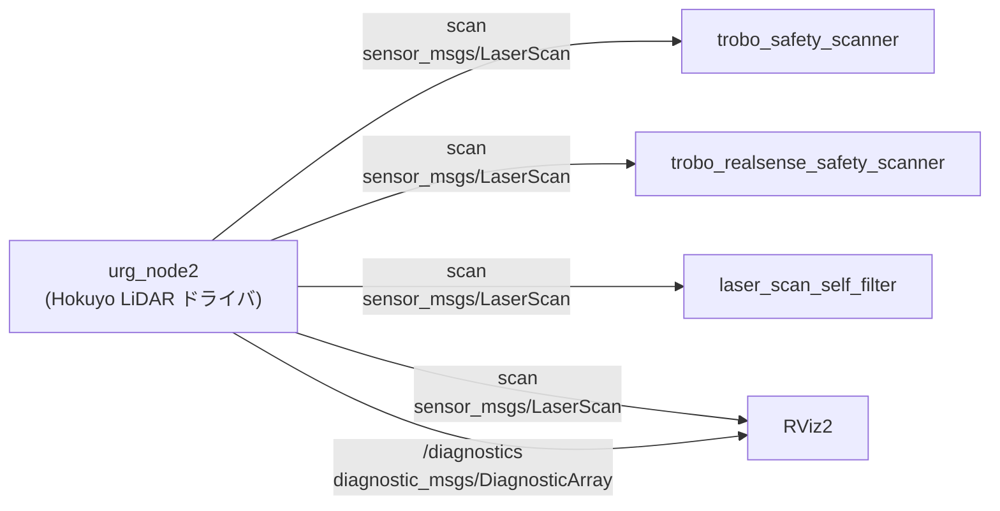

# インターフェース定義

## 1. 概要

`urg_node2` パッケージは独自のインターフェース定義 (.msg / .srv / .action) を持たない。標準の `sensor_msgs` および `diagnostic_msgs` のメッセージ型を使用して、LiDAR スキャンデータと診断情報を配信する。

本パッケージはライフサイクルノードであり、ライフサイクル制御用の標準サービス (`lifecycle_msgs`) が自動的に提供される。

## 2. 利用パッケージマップ

## 3. パブリッシュトピック詳細

### 3.1. scan (シングルエコーモード)

`publish_multiecho` が `false` の場合に配信される。

- **トピック名**: `scan` (Launch 引数でリマップ可能)
- **メッセージ型**: `sensor_msgs/msg/LaserScan`
- **QoS**: depth=20, デフォルト設定
- **配信条件**: Active 状態かつスキャンデータ取得成功時

| フィールド名 | 型 | 単位 | 説明 |
| --- | --- | --- | --- |
| `header.stamp` | `builtin_interfaces/Time` | - | スキャン取得時刻 (補正済み) |
| `header.frame_id` | `string` | - | `frame_id` パラメータの値 (先頭の `/` は除去) |
| `angle_min` | `float32` | rad | スキャン開始角度 (LiDAR ステップから変換) |
| `angle_max` | `float32` | rad | スキャン終了角度 (LiDAR ステップから変換) |
| `angle_increment` | `float32` | rad | 各ビーム間の角度間隔 = `cluster * urg_step2rad(1)` |
| `time_increment` | `float32` | sec | 各ビーム間の時間間隔 |
| `scan_time` | `float32` | sec | 1 回のスキャンに要する時間 |
| `range_min` | `float32` | m | LiDAR の最小測定距離 |
| `range_max` | `float32` | m | LiDAR の最大測定距離 |
| `ranges` | `float32[]` | m | 距離データ配列。無効値は `NaN` |
| `intensities` | `float32[]` | - | 強度データ配列 (`publish_intensity=true` かつ LiDAR 対応時のみ) |

### 3.2. echoes (マルチエコーモード)

`publish_multiecho` が `true` かつ LiDAR がマルチエコーに対応している場合に配信される。

- **トピック名**: `echoes`
- **メッセージ型**: `sensor_msgs/msg/MultiEchoLaserScan`
- **QoS**: `laser_proc::LaserPublisher` により設定 (depth=20)
- **配信条件**: Active 状態かつスキャンデータ取得成功時

| フィールド名 | 型 | 単位 | 説明 |
| --- | --- | --- | --- |
| `header.stamp` | `builtin_interfaces/Time` | - | スキャン取得時刻 (補正済み) |
| `header.frame_id` | `string` | - | `frame_id` パラメータの値 |
| `angle_min` | `float32` | rad | スキャン開始角度 |
| `angle_max` | `float32` | rad | スキャン終了角度 |
| `angle_increment` | `float32` | rad | 各ビーム間の角度間隔 |
| `time_increment` | `float32` | sec | 各ビーム間の時間間隔 |
| `scan_time` | `float32` | sec | 1 回のスキャンに要する時間 |
| `range_min` | `float32` | m | 最小測定距離 |
| `range_max` | `float32` | m | 最大測定距離 |
| `ranges` | `LaserEcho[]` | m | マルチエコー距離データ (各ビームで最大 3 エコー) |
| `intensities` | `LaserEcho[]` | - | マルチエコー強度データ (`publish_intensity=true` 時のみ) |

### 3.3. first / last / most_intense (マルチエコー分解トピック)

`laser_proc::LaserPublisher` によりマルチエコーデータから自動的に生成される `LaserScan` トピック。

| トピック名 | メッセージ型 | 説明 |
| --- | --- | --- |
| `first` | `sensor_msgs/msg/LaserScan` | 各ビームの最初のエコーのみ抽出 |
| `last` | `sensor_msgs/msg/LaserScan` | 各ビームの最後のエコーのみ抽出 |
| `most_intense` | `sensor_msgs/msg/LaserScan` | 各ビームの最大強度エコーのみ抽出 |

### 3.4. /diagnostics

`diagnostic_updater` により自動配信される。

- **トピック名**: `/diagnostics`
- **メッセージ型**: `diagnostic_msgs/msg/DiagnosticArray`
- **配信条件**: Active 状態のみ

詳細は [README.md 9. 診断情報](./README.md#9-診断情報) を参照。

## 4. ライフサイクルサービス (自動提供)

`rclcpp_lifecycle` により自動的に以下のサービスが提供される。

| サービス名 | サービス型 | 説明 |
| --- | --- | --- |
| `~/change_state` | `lifecycle_msgs/srv/ChangeState` | ライフサイクル状態を遷移させる |
| `~/get_state` | `lifecycle_msgs/srv/GetState` | 現在のライフサイクル状態を取得する |
| `~/get_available_states` | `lifecycle_msgs/srv/GetAvailableStates` | 取りうる全状態の一覧を取得する |
| `~/get_available_transitions` | `lifecycle_msgs/srv/GetAvailableTransitions` | 現在の状態から可能な遷移の一覧を取得する |

## 5. 計測モード一覧

LiDAR の能力と設定パラメータの組み合わせにより、以下のいずれかの計測モードが選択される。

| publish_intensity | publish_multiecho | 計測モード | パブリッシュトピック |
| --- | --- | --- | --- |
| `false` | `false` | `URG_DISTANCE` | `scan` |
| `true` | `false` | `URG_DISTANCE_INTENSITY` | `scan` (intensities 付き) |
| `false` | `true` | `URG_MULTIECHO` | `echoes`, `first`, `last`, `most_intense` |
| `true` | `true` | `URG_MULTIECHO_INTENSITY` | `echoes`, `first`, `last`, `most_intense` (intensities 付き) |

LiDAR が指定モードに非対応の場合は、対応するモードに自動フォールバックし WARN ログが出力される。
