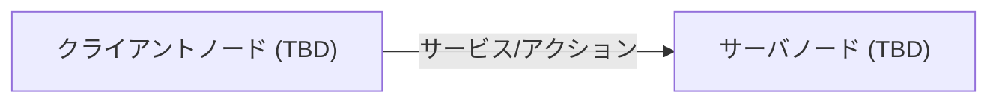

# インターフェース定義

## 1. 概要

<!-- TODO: このパッケージのインターフェース定義の目的と利用方法を記述 -->

Hokuyo 2D LiDARセンサドライバ。レーザスキャンデータをROS2トピックとして配信する

## 2. 利用パッケージマップ

## 3. メッセージ定義（.msg）

<!-- TODO: .msgファイルの定義を記述 -->

| メッセージ名 | フィールド | 型 | 単位 | 説明 |
| --- | --- | --- | --- | --- |
| TBD | TBD | TBD | TBD | TBD |

## 4. サービス定義（.srv）

<!-- TODO: .srvファイルの定義を記述 -->

### TBD.srv

**目的**: TBD

**サーバノード**: TBD | **クライアントノード**: TBD

**Request:**

| フィールド名 | 型 | 単位 | 説明 |
| --- | --- | --- | --- |
| TBD | TBD | TBD | TBD |

**Response:**

| フィールド名 | 型 | 説明 | success=falseの場合 |
| --- | --- | --- | --- |
| success | bool | 処理成功フラグ | エラー内容をmessageに格納 |
| message | string | 結果メッセージ | エラー詳細 |

## 5. アクション定義（.action）

<!-- TODO: .actionファイルの定義を記述 -->

### TBD.action

**Goal:**

| フィールド名 | 型 | 単位 | 説明 |
| --- | --- | --- | --- |
| TBD | TBD | TBD | TBD |

**Result:**

| フィールド名 | 型 | 説明 |
| --- | --- | --- |
| TBD | TBD | TBD |

**Feedback:**

| フィールド名 | 型 | 説明 |
| --- | --- | --- |
| TBD | TBD | TBD |
