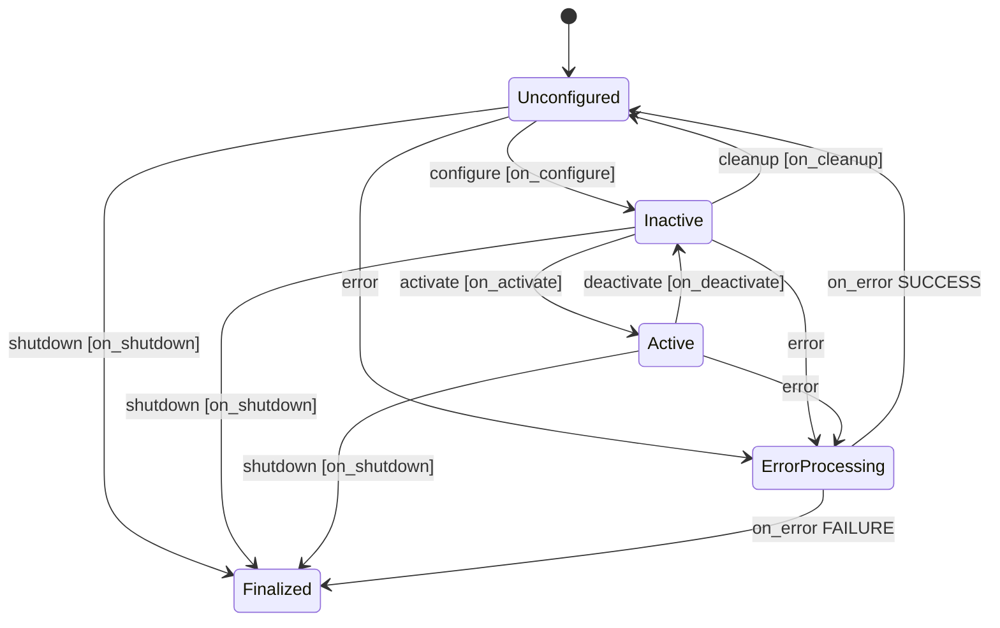
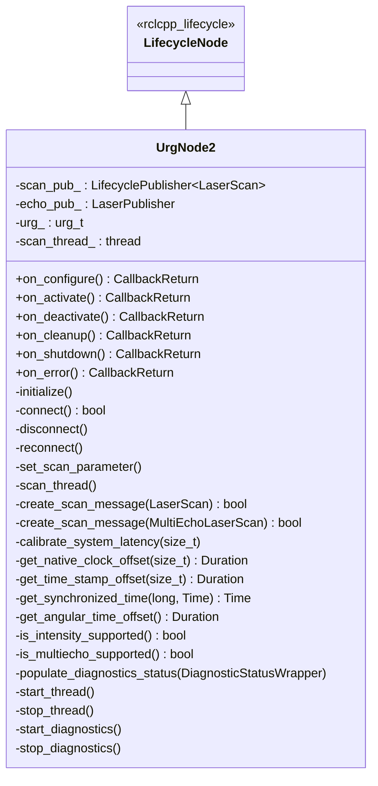
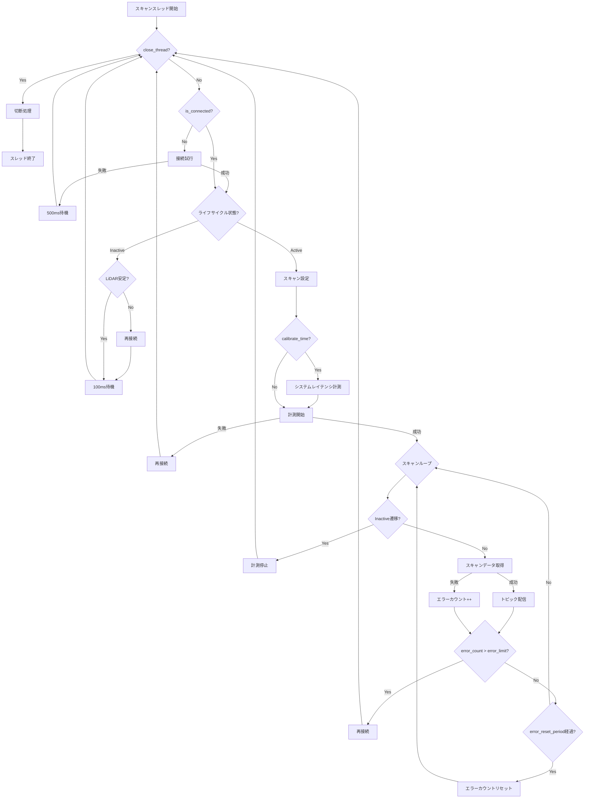

# urg_node2

| 項目 | 内容 |
| --- | --- |
| 言語 | C++ |
| ノード種別 | ライフサイクルノード (`rclcpp_lifecycle::LifecycleNode`) |
| 関連PKG文書 | PKG-044 |
| 最終更新日 | 2026-02-27 |

## 1. 概要

`urg_node2` は Hokuyo (北陽電機) 製 2D LiDAR センサ用の ROS2 ドライバパッケージである。URG シリーズの LiDAR と Ethernet またはシリアル (RS-232C / USB) 接続で通信し、レーザスキャンデータを `sensor_msgs/msg/LaserScan` または `sensor_msgs/msg/MultiEchoLaserScan` トピックとして配信する。

本パッケージはライフサイクルノードとして実装されており、ノードの状態遷移に応じて LiDAR の接続・計測開始・停止・切断を制御する。また `rclcpp_components` に登録されているため、コンポーネントノードとしてコンテナに動的にロードすることも可能である。

T-Robo システムでは安全 LiDAR スキャナとして使用され、`trobo_safety_scanner` や `trobo_realsense_safety_scanner` がこのノードの出力を利用する。

**主要責務:**

- Hokuyo 2D LiDAR との Ethernet / シリアル接続管理
- レーザスキャンデータの取得と ROS2 トピックとしての配信
- シングルエコー / マルチエコー / 強度出力モードの切替
- タイムスタンプの校正と同期 (calibrate_time, synchronize_time)
- 通信エラー検知と自動再接続
- `diagnostic_updater` による診断情報の提供

## 2. 依存パッケージ

| パッケージ名 | 用途 |
| --- | --- |
| `rclcpp` | ROS2 C++ クライアントライブラリ |
| `rclcpp_components` | コンポーネントノード登録 |
| `rclcpp_lifecycle` | ライフサイクルノード基底クラス |
| `lifecycle_msgs` | ライフサイクル状態遷移メッセージ |
| `sensor_msgs` | `LaserScan` / `MultiEchoLaserScan` メッセージ型 |
| `diagnostic_updater` | 診断情報の定期更新 |
| `laser_proc` | マルチエコーデータの分解パブリッシュ (`LaserPublisher`) |
| `urg_library` (内蔵) | Hokuyo URG センサ通信 C ライブラリ (パッケージ内に同梱) |

## 3. インターフェース

詳細は [01_interfaces.md](./01_interfaces.md) を参照。

### トピック (パブリッシュ) -- シングルエコーモード

| トピック名 | メッセージ型 | QoS depth | 説明 |
| --- | --- | --- | --- |
| `scan` | `sensor_msgs/msg/LaserScan` | 20 | レーザスキャンデータ (距離 + オプション強度) |

### トピック (パブリッシュ) -- マルチエコーモード

| トピック名 | メッセージ型 | QoS depth | 説明 |
| --- | --- | --- | --- |
| `echoes` | `sensor_msgs/msg/MultiEchoLaserScan` | 20 | マルチエコースキャンデータ |
| `first` | `sensor_msgs/msg/LaserScan` | 20 | 最初のエコー (laser_proc による分解) |
| `last` | `sensor_msgs/msg/LaserScan` | 20 | 最後のエコー (laser_proc による分解) |
| `most_intense` | `sensor_msgs/msg/LaserScan` | 20 | 最大強度のエコー (laser_proc による分解) |

### トピック (パブリッシュ) -- 診断

| トピック名 | メッセージ型 | 説明 |
| --- | --- | --- |
| `/diagnostics` | `diagnostic_msgs/msg/DiagnosticArray` | ハードウェア診断情報 (Active 状態のみ) |

### トピック (サブスクライブ)

本ノードはトピックをサブスクライブしない。

### サービス (提供)

本ノードは独自のサービスを提供しない。ライフサイクル制御用の標準サービス (`change_state`, `get_state` 等) は `rclcpp_lifecycle` により自動提供される。

## 4. パラメータ

### 接続設定パラメータ

| パラメータ名 | 型 | デフォルト値 | 単位 | 説明 |
| --- | --- | --- | --- | --- |
| `ip_address` | string | `""` (空文字) | - | Ethernet 接続先の IP アドレス。空文字の場合はシリアル接続を使用する |
| `ip_port` | int | `10940` | - | Ethernet 接続先ポート番号 |
| `serial_port` | string | `"/dev/ttyACM0"` | - | シリアル接続先デバイスパス (`ip_address` が空の場合に使用) |
| `serial_baud` | int | `115200` | bps | シリアル通信ボーレート |

### スキャン設定パラメータ

| パラメータ名 | 型 | デフォルト値 | 単位 | 有効範囲 | 説明 |
| --- | --- | --- | --- | --- | --- |
| `frame_id` | string | `"laser"` | - | - | パブリッシュされるスキャンメッセージの `header.frame_id` |
| `publish_intensity` | bool | `false` | - | - | `true`: 強度データ付きスキャンモードを使用する。LiDAR が非対応の場合は自動で無効になる |
| `publish_multiecho` | bool | `false` | - | - | `true`: マルチエコーモードを使用する。LiDAR が非対応の場合はシングルモードにフォールバックする |
| `angle_min` | double | `-3.14159` | rad | [-pi, pi] | スキャン出力範囲の開始角度。範囲外の値はクリップされる |
| `angle_max` | double | `3.14159` | rad | [-pi, pi] | スキャン出力範囲の終了角度。範囲外の値はクリップされる |
| `skip` | int | `0` | - | [0, 9] | スキャンデータの間引き設定。N を指定すると N 回のスキャンをスキップし N+1 回目を配信する |
| `cluster` | int | `1` | - | [1, 99] | グルーピング設定。隣接する N ステップをまとめて 1 データポイントとする |

### 時刻補正パラメータ

| パラメータ名 | 型 | デフォルト値 | 単位 | 説明 |
| --- | --- | --- | --- | --- |
| `calibrate_time` | bool | `false` | - | `true`: スキャン開始前にシステムレイテンシの計測を行う (実験的機能) |
| `synchronize_time` | bool | `false` | - | `true`: LiDAR のハードウェアクロックとシステム時刻の指数移動平均 (EMA) による動的同期を行う |
| `time_offset` | double | `0.0` | sec | ユーザ指定のタイムスタンプオフセット。スキャンメッセージのタイムスタンプに加算される |

### エラー処理パラメータ

| パラメータ名 | 型 | デフォルト値 | 単位 | 説明 |
| --- | --- | --- | --- | --- |
| `error_limit` | int | `4` | - | この回数を超える連続エラーが発生した場合に自動再接続を行う |
| `error_reset_period` | double | `5.0` | sec | エラーカウンタをリセットする周期 |

### 診断パラメータ

| パラメータ名 | 型 | デフォルト値 | 単位 | 説明 |
| --- | --- | --- | --- | --- |
| `diagnostics_tolerance` | double | `0.05` | - | 診断のスキャン周波数許容範囲 (比率) |
| `diagnostics_window_time` | double | `5.0` | sec | 診断の周波数測定ウィンドウ時間 |

### YAML 設定例 (Ethernet 接続)

```yaml
urg_node2:
  ros__parameters:
    ip_address: '192.168.50.41'
    ip_port: 10940
    frame_id: 'laser_left'
    calibrate_time: false
    synchronize_time: false
    publish_intensity: false
    publish_multiecho: false
    error_limit: 4
    error_reset_period: 5.0
    diagnostics_tolerance: 0.05
    diagnostics_window_time: 5.0
    time_offset: 0.0
    angle_min: -3.14
    angle_max: 3.14
    skip: 0
    cluster: 1
```

### YAML 設定例 (シリアル接続)

```yaml
urg_node2:
  ros__parameters:
    serial_port: '/dev/ttyACM0'
    serial_baud: 115200
    frame_id: 'laser'
    calibrate_time: false
    synchronize_time: false
    publish_intensity: false
    publish_multiecho: false
    error_limit: 4
    error_reset_period: 5.0
    diagnostics_tolerance: 0.05
    diagnostics_window_time: 5.0
    time_offset: 0.0
    angle_min: -3.14
    angle_max: 3.14
    skip: 0
    cluster: 1
```

## 5. ライフサイクル状態遷移



### 各遷移の処理内容

| 遷移 | コールバック | 処理内容 |
| --- | --- | --- |
| Unconfigured -> Inactive | `on_configure` | パラメータ取得・内部初期化、LiDAR 接続、Publisher 作成、スキャンスレッド起動 |
| Inactive -> Active | `on_activate` | Publisher 有効化、Diagnostics 開始、エラーカウンタ初期化 |
| Active -> Inactive | `on_deactivate` | Diagnostics 停止、LiDAR 接続状態チェック |
| Inactive -> Unconfigured | `on_cleanup` | スキャンスレッド停止、Publisher 解放、LiDAR 切断 |
| Any -> Finalized | `on_shutdown` | スキャンスレッド停止、Diagnostics 停止、Publisher 解放、LiDAR 切断 |
| Any -> ErrorProcessing | `on_error` | スキャンスレッド停止、Diagnostics 停止、Publisher 解放、LiDAR 切断 |

## 6. 内部アーキテクチャ

### クラス構成



### スキャンスレッドの動作フロー



### タイムスタンプ補正の仕組み

スキャンデータのタイムスタンプは以下の要素で補正される:

```text
最終タイムスタンプ = system_time_stamp + system_latency + user_latency + angular_time_offset
```

| 要素 | 算出方法 |
| --- | --- |
| `system_time_stamp` | `synchronize_time=true` の場合は EMA で補正されたハードウェアクロック、`false` の場合はシステム時刻 |
| `system_latency` | `calibrate_time=true` の場合に計測される通信レイテンシの中央値 (10 回計測) |
| `user_latency` | `time_offset` パラメータの値 |
| `angular_time_offset` | スキャン開始角度までの回転時間 = `(angle_min + pi) / (2 * pi) * scan_period` |

## 7. 起動方法

### 単体起動 (ライフサイクルノード / 自動 Active 遷移)

```bash
ros2 launch urg_node2 urg_node2.launch.py
```

**Launch 引数:**

| 引数名 | デフォルト値 | 説明 |
| --- | --- | --- |
| `auto_start` | `true` | 起動時に自動で Active 状態まで遷移する |
| `node_name` | `urg_node2` | ノード名 |
| `scan_topic_name` | `scan` | スキャントピック名 (シングルエコーモードのみリマップ対応) |

### コンポーネントノードとして起動

```bash
ros2 launch urg_node2 urg_node2_component.launch.py
```

コンテナ (`app_container`) 内にコンポーネントとしてロードする。ライフサイクル自動遷移は含まれないため、手動で `configure` / `activate` を実行する必要がある。

### 2 台同時起動

```bash
ros2 launch urg_node2 urg_node2_2lidar.launch.py
```

**Launch 引数:**

| 引数名 | デフォルト値 | 説明 |
| --- | --- | --- |
| `auto_start` | `true` | 自動 Active 遷移 |
| `node_name_1st` | `urg_node2_1st` | 1 台目のノード名 |
| `node_name_2nd` | `urg_node2_2nd` | 2 台目のノード名 |
| `scan_topic_name_1st` | `scan_1st` | 1 台目のスキャントピック名 |
| `scan_topic_name_2nd` | `scan_2nd` | 2 台目のスキャントピック名 |

### 3 台同時起動

```bash
ros2 launch urg_node2 urg_node2_3lidar.launch.py
```

**Launch 引数:**

| 引数名 | デフォルト値 | 説明 |
| --- | --- | --- |
| `auto_start` | `true` | 自動 Active 遷移 |
| `node_name_1st` | `urg_node2_1st` | 1 台目 (左) のノード名 |
| `node_name_2nd` | `urg_node2_2nd` | 2 台目 (右) のノード名 |
| `node_name_3rd` | `urg_node2_3rd` | 3 台目 (中央) のノード名 |
| `scan_topic_name_1st` | `scan_left` | 1 台目のスキャントピック名 |
| `scan_topic_name_2nd` | `scan_right` | 2 台目のスキャントピック名 |
| `scan_topic_name_3rd` | `scan_center` | 3 台目のスキャントピック名 |

### 手動ライフサイクル遷移

```bash
# Unconfigured -> Inactive
ros2 lifecycle set /urg_node2 configure

# Inactive -> Active
ros2 lifecycle set /urg_node2 activate

# Active -> Inactive
ros2 lifecycle set /urg_node2 deactivate

# Inactive -> Unconfigured
ros2 lifecycle set /urg_node2 cleanup
```

## 8. 設定ファイル

| ファイル名 | 説明 |
| --- | --- |
| `config/params_ether_left.yaml` | Ethernet 接続 左 LiDAR (IP: 192.168.50.41, frame: laser_left) |
| `config/params_ether_right.yaml` | Ethernet 接続 右 LiDAR (IP: 192.168.50.42, frame: laser_right) |
| `config/params_ether_center.yaml` | Ethernet 接続 中央 LiDAR (IP: 192.168.50.43, frame: laser_center) |
| `config/params_serial.yaml` | シリアル接続 (/dev/ttyACM0, frame: laser) |

## 9. 診断情報

Active 状態では `diagnostic_updater` により `/diagnostics` トピックが配信される。

### 診断フィールド

| フィールド名 | 説明 |
| --- | --- |
| `IP Address` / `Serial Port` | 接続情報 |
| `IP Port` / `Serial Baud` | 接続パラメータ |
| `Product Name` | LiDAR 製品名 |
| `Firmware Version` | ファームウェアバージョン |
| `Device ID` | デバイスシリアル ID |
| `Computed Latency` | 計測されたシステムレイテンシ (sec) |
| `User Time Offset` | ユーザ指定タイムオフセット (sec) |
| `Device Status` | デバイス状態文字列 |
| `Sensor Status` | センサ状態文字列 |
| `Scan Retrieve Error Count` | 現在のエラーカウント (再接続時リセット) |
| `Scan Retrieve Total Error Count` | 累計エラーカウント (Active 遷移時リセット) |
| `Reconnection Count` | 再接続回数 |

### 診断ステータスレベル

| レベル | 条件 |
| --- | --- |
| OK | 正常ストリーミング中 |
| WARN | 強度/マルチエコーが設定されているが実際には動作していない |
| ERROR | 未接続、計測未開始、またはセンサ異常 |

## 10. テスト

本パッケージは GTest によるユニットテストを提供する。テストは実機 (UTM-30LX-EW) への Ethernet 接続 (IP: 192.168.0.10) が必要である。

```bash
colcon build --packages-select urg_node2
source install/setup.bash
colcon test --packages-select urg_node2
colcon test-result --verbose
```

### テストケース

| テスト名 | 内容 |
| --- | --- |
| `UTM_30_LX_EW.normal_scan` | シングルエコーモードの基本動作とライフサイクル遷移 |
| `UTM_30_LX_EW.intensity_scan` | 強度出力モード + angle_min/max/skip/cluster パラメータの適用確認 |
| `UTM_30_LX_EW.multiecho_scan` | マルチエコーモードの基本動作 |
| `UTM_30_LX_EW.multiecho_intensity_scan` | マルチエコー + 強度出力モードとライフサイクル遷移 |
| `UTM_30_LX_EW.normal_scan_param` | angle_min = angle_max 時のエッジケース処理 |
| `UTM_30_LX_EW.normal_scan_param_angle_min` | angle_min が範囲外の場合のクリップ処理 |
| `UTM_30_LX_EW.normal_scan_param_angle_max` | angle_max が範囲外の場合のクリップ処理 |

## 11. 既知の問題・制限事項

- スキャンデータの最大サイズが `URG_NODE2_MAX_DATA_SIZE` (5000) でハードコードされている (FIXME マーク付き)
- `calibrate_time` 機能は実験的 (experimental) であり、精度が環境に依存する
- `synchronize_time` の EMA では、0.1 秒以上のずれを検出するとリセットが行われる
- マルチエコーモード使用時、Launch 引数による `scan` トピックのリマップは非対応。直接 `remappings` を編集する必要がある
- `urg_library` のコードに対してはリントチェック (ament_lint) が無効化されている
- LiDAR の電源が OFF になった状態で通信しようとすると SIGPIPE が発生するため、コンストラクタで `SIGPIPE` を無視する設定を行っている

## 関連ドキュメント

- [English version](../EN/README.md)
- [インターフェース定義](./01_interfaces.md)
- trobo_docs PKG 文書: PKG-044

## 変更履歴

| 日付 | バージョン | 変更内容 | 担当者 |
| --- | --- | --- | --- |
| 2026-02-27 | 1.0 | 初版作成 (ソースコードからの技術ドキュメント作成) | Claude Code |
